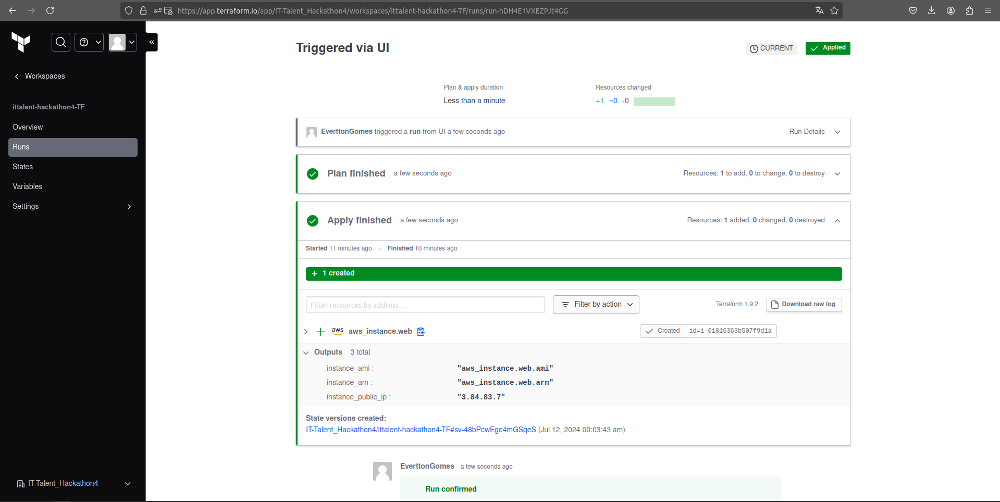

# ittalent-hackathon4-TF

## Antonio Everton Gomes Do Nascimento

### Descrição da atividade
Para essa atividade, você deverá criar um EC2 na AWS via Terraform Cloud.

### Prints

#### Instancia EC2

#### terraform cloud

